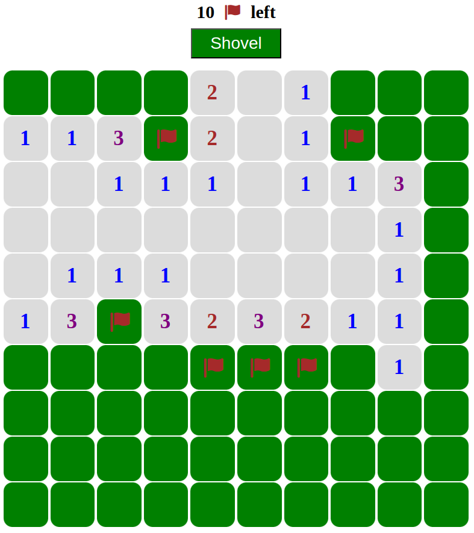
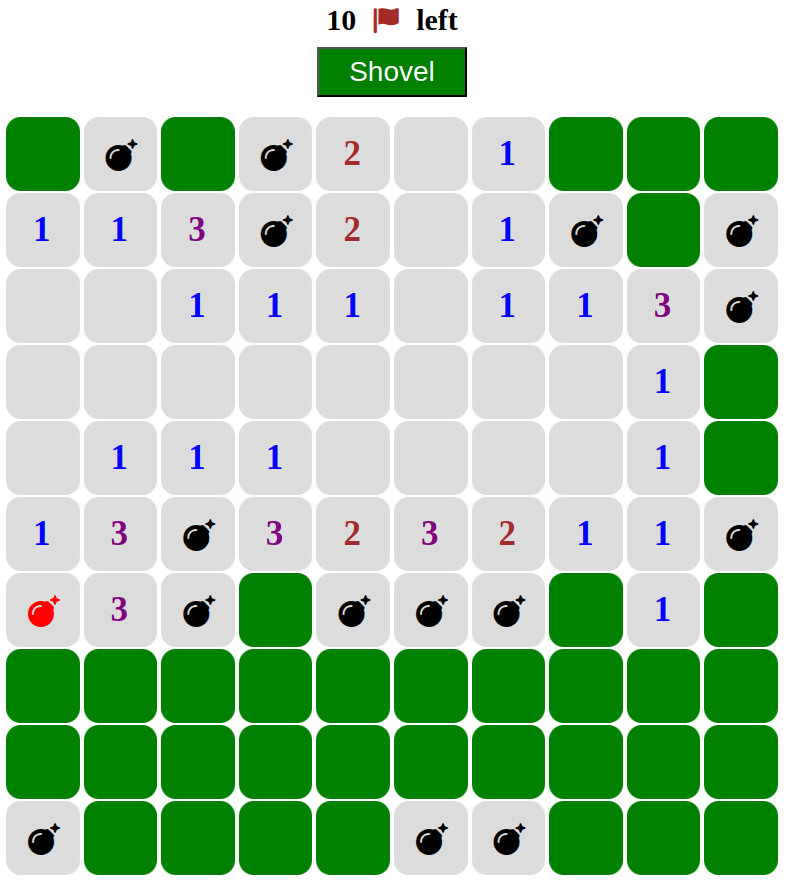

# 💣 Minesweeper

A simple clone of the classic **Minesweeper** game built with **HTML**, **CSS**, and **vanilla JavaScript**.

## 🚀 How to Play

1. Clone or download this repository.
2. Open the `index.html` file in your browser.

> No installation needed — everything runs locally in your browser.

## 🎮 Features

- Randomly generated minefield
- Remaining mine counter
- Flagging
- Win and loss detection
- Simple interface

## 🛠️ Technologies Used

- HTML5  
- CSS3  
- JavaScript (Vanilla)

## 📦 Dependencies

- [Font Awesome 6.2.0](https://fontawesome.com) (included locally in the `Icons/` folder)

## 📁 Project Structure

```bash
minesweeper/
├── index.html
├── style.css
├── script.js
├── Icons/
│   └── fontawesome-free-6.2.0-web/
│       ├── css/
│       │   └── ... (css files)
│       └── webfonts/
│           └── ... (font files)
└── Screenshots/
    ├── screenshot0.png
    └── screenshot1.png
```

## 📷 Screenshots

<p align="center">
  
  
</p>

## 📄 License

This project is licensed under the MIT License - see the [LICENSE](LICENSE) file for details.

---

Built with ❤️ just for fun.

